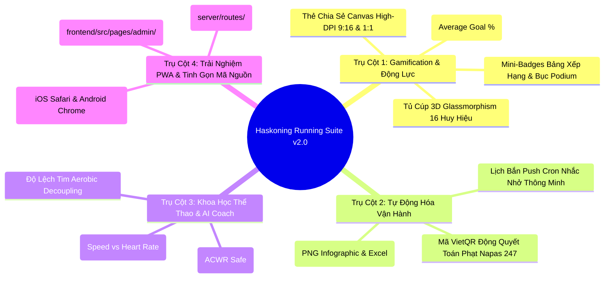
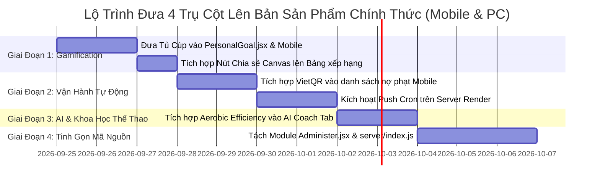

# Kế Hoạch Chiến Lược Toàn Diện: 4 Trụ Cột Nâng Cấp Nền Tảng (Strategic 4-Pillar Upgrade Plan)

> **Dự Án:** Haskoning Strava Desktop & Cloud Suite (Royal HaskoningDHV Running Club)  
> **Phiên Bản Quy Hoạch:** v2.0 Next-Gen Ecosystem  
> **Trạng Thái:** 📋 Kế Hoạch Chiến Lược Đã Phê Duyệt & Đã Nghiệm Thu Prototype PC (/nextgen)  
> **Tài Liệu Lưu Trữ:** `Plans/PLAN_CHIEN_LUOC_NANG_CAP_4_TRU_COT_TOAN_DIEN.md`

---

## I. Bối Cảnh & Tầm Nhìn Chiến Lược

Phần mềm **Strava Desktop Software & Cloud Mobile Web** của CLB Chạy bộ Royal HaskoningDHV đã vận hành ổn định qua nhiều mùa giải, hỗ trợ theo dõi thành tích, bảng xếp hạng và quản lý quỹ kỷ luật. Để phát triển nền tảng thành một hệ sinh thái văn hóa thể thao doanh nghiệp vượt trội, kết nối sâu sắc giữa các thành viên, kế hoạch này quy hoạch **4 Trụ Cột Nâng Cấp Trọng Yếu**:

1. **Trụ Cột 1 (Gamification & Engagement):** Kích hoạt động lực luyện tập qua Tủ Cúp 3D 16 Huy Hiệu và Thẻ Chia Sẻ Canvas Mạng Xã Hội 9:16 & 1:1.
2. **Trụ Cột 2 (Automation & Smart Operations):** Giảm tải 80% thao tác thủ công cho Ban Quản trị qua Mã VietQR Động Quyết Toán Phạt, Hệ Thống Push Cron Thông Minh và Xuất Báo Cáo Tháng 1-Chạm.
3. **Trụ Cột 3 (Sports Science & AI Coach):** Đo lường Hiệu Suất Hiếu Khí (Aerobic Efficiency - Tốc độ vs Nhịp tim) và Tự động sinh Lịch tập 7 ngày thích ứng an toàn.
4. **Trụ Cột 4 (PWA Experience & Tech Health):** Cài đặt PWA 1-chạm như Native App và Tinh gọn, module hóa mã nguồn (`Administer.jsx` & `server/index.js`).

---

## II. Sơ Đồ Kiến Trúc Tổng Thể 4 Trụ Cột

---

## III. Chi Tiết Từng Trụ Cột Nâng Cấp

---

### 🏆 TRỤ CỘT 1: ĐỘT PHÁ TRẢI NGHIỆM & KÍCH HOẠT ĐỘNG LỰC (GAMIFICATION & ENGAGEMENT)

#### 1. Mục Tiêu
- Xây dựng cơ chế khen thưởng vi mô (Micro-rewards) liên tục sau mỗi hoạt động chạy để duy trì thói quen xỏ giày.
- Tôn vinh nỗ lực cá nhân và khích lệ tinh thần đồng đội qua các danh hiệu trực quan, mang đậm bản sắc thương hiệu Haskoning.

#### 2. Hệ Thống 16 Huy Hiệu Vinh Danh (5 Nhóm Cốt Lõi)
Được tính toán tự động qua `badgeEngine.js` dựa trên `athleteId` (Tuân thủ Rule 6):
1. **Cột Mốc Cự Ly Đơn Lẻ:**
   - 🥉 **Tân Binh 5K (Bronze):** Hoàn thành buổi chạy $\ge 5\text{ km}$.
   - 🥈 **Chiến Binh 10K (Silver):** Hoàn thành buổi chạy $\ge 10\text{ km}$.
   - 🥇 **Bán Marathon 21K (Gold):** Chinh phục cự ly Half Marathon $\ge 21.1\text{ km}$.
   - 💎 **Huyền Thoại Marathon 42K (Diamond):** Chinh phục cự ly Full Marathon $\ge 42.195\text{ km}$.
2. **Tích Lũy Quãng Đường (Milestone Club):**
   - 🥉 **CLB 50K (50km Club):** Tích lũy tổng cự ly tháng $\ge 50\text{ km}$.
   - 🥈 **Chiến Binh Bách Dặm (100K Centurion):** Tích lũy tổng cự ly tháng $\ge 100\text{ km}$.
   - 🥇 **Siêu Nhân Bền Bỉ (150K Titanium):** Tích lũy tổng cự ly tháng $\ge 150\text{ km}$.
   - ⚡ **Quái Kiệt Đường Chạy (200K+ The Beast):** Tích lũy tổng cự ly tháng $\ge 200\text{ km}$.
   - 👑 **Đại Sứ Lịch Sử (500K Legend):** Tích lũy cự ly lịch sử toàn thời gian $\ge 500\text{ km}$.
3. **Kỷ Luật & Thói Quen (Consistency & Habit):**
   - 🔥 **Ngọn Lửa Bền Bỉ (Streak Fire):** Duy trì 4 tuần liên tiếp, mỗi tuần $\ge 2$ buổi chạy hợp lệ.
   - 🛡️ **Lá Chắn Bất Bại (Zero Penalty Shield):** Hoàn thành 100% mục tiêu tháng, 0 đồng tiền phạt kỷ luật.
   - ⭐ **Vượt Ngưỡng Kỳ Tích (Overachiever):** Đạt trên 120% cự ly mục tiêu cá nhân đã đăng ký.
   - 📅 **Chiến Binh Cuối Tuần (Weekend Warrior):** Chạy liên tiếp cả 2 ngày Thứ 7 và Chủ Nhật.
   - 🌟 **Chuyên Cần Vàng (Consistency King):** Có từ 15 ngày xỏ giày chạy trong tháng trở lên.
4. **Phong Cách Chạy (Running Persona):**
   - 🌅 **Chim Sớm Haskoning (Early Bird):** Hoàn thành bài chạy xuất phát trước 06:00 sáng.
   - 🌙 **Cú Đêm Xả Stress (Night Owl):** Hoàn thành bài chạy xuất phát sau 20:00 tối.
5. **Tốc Độ & Bứt Phá (Speed & Performance):**
   - ⚡ **Tia Chớp 5K (Sub-30 Flash):** Chạy 5km với Pace trung bình dưới 6:00 min/km.
   - 🚀 **Hỏa Tiễn 5K (Sub-25 Rocket):** Chạy 5km với Pace trung bình dưới 5:00 min/km.

#### 3. Tủ Cúp 3D Glassmorphism (`TrophyCabinet.jsx`)
- Thiết kế chuẩn nhận diện Haskoning: Nền kính mờ với viền ánh kim dải Teal (`#00A3A6`), Navy (`#002D54`) và Lime Green (`#78BE20`).
- Thanh tiến độ tổng quan: `🏆 9 / 16 Huy Hiệu Đã Đạt (56%)`.
- Bộ lọc danh mục mượt mà: *Tất cả*, *Cự ly*, *Tích lũy*, *Kỷ luật*, *Phong cách*, *Tốc độ*.
- Modal chi tiết huy hiệu: Hiển thị icon 3D nổi bật, ngày mở khóa, tiêu chí và thông điệp truyền cảm hứng.

#### 4. Thẻ Chia Sẻ Canvas Mạng Xã Hội High-DPI (`SocialShareModal.jsx`)
- Render đồ họa trực tiếp bằng HTML5 Canvas siêu nét (Retina Scale $2\times$).
- Hỗ trợ 2 tỷ lệ chuẩn:
  - **Story 9:16 (1080 x 1920 px):** Tối ưu cho Facebook Story, Instagram Story.
  - **Vuông 1:1 (1200 x 1200 px):** Tối ưu chia sẻ bài đăng Zalo, nhóm chat MS Teams Haskoning.
- Nội dung thẻ: Logo Haskoning, họ tên VĐV, tổng km, số bài chạy, pace trung bình, dải huy hiệu sáng giá nhất tháng và mã QR tham gia CLB.
- Tiện ích 1-chạm: Nút **Tải ảnh PNG** và nút **Sao chép ảnh vào Clipboard** (dán thẳng vào chat).

---

### ⚡ TRỤ CỘT 2: TỰ ĐỘNG HÓA VẬN HÀNH ADMIN (AUTOMATION & SMART OPERATIONS)

#### 1. Mục Tiêu
- Giảm tải 80% thời gian của Ban Quản trị trong việc nhắc nhở nợ phạt, đối soát chuyển khoản và lập báo cáo định kỳ.
- Nâng cao tính chuyên nghiệp, minh bạch tài chính và trải nghiệm nộp quỹ không chạm.

#### 2. Mã VietQR Động Quyết Toán Phạt (`VietQRPenaltyModal.jsx`)
- Tự động sinh mã VietQR chuẩn liên ngân hàng Napas 247 qua chuẩn `img.vietqr.io`:
  - **Ngân hàng & Số tài khoản thủ quỹ:** Đọc cấu hình tập trung từ `challenge_config.json`.
  - **Số tiền thanh toán chính xác:** Tự động điền đúng số tiền phạt theo km còn thiếu (ví dụ: `140,000 VND`).
  - **Cú pháp chuyển khoản định danh:** `[HRC] <AthleteName> nop phat T<Month>`.
- Nút tiện ích: Sao chép STK kèm Toast, Sao chép Nội dung CK, Tải ảnh mã QR.

#### 3. Hệ Thống Push Cron Thông Minh (`server/cron.js`)
- Tự động hóa lịch quét và bắn thông báo Web Push cá nhân hóa:
  - **Lịch Nhắc Cuối Tuần (19:00 Chủ Nhật):** Quét những ai còn thiếu dưới 10km để thúc đẩy về đích tuần.
  - **Lịch Chốt Tháng (09:00 các ngày 28, 29, 30, 31):** Cảnh báo nguy cơ nộp phạt quỹ 200k nếu không kịp hoàn thành km.
  - **Lịch Quyết Toán Phạt (Ngày 1 đầu tháng):** Bắn push thông báo số tiền phạt cụ thể kèm nút mở nhanh mã VietQR.

#### 4. Xuất Báo Cáo Tháng 1-Chạm (`MonthlyReportExportModal.jsx`)
- Tích hợp tại Dashboard và Administer:
  - **Infographic PNG:** Tóm tắt vinh danh Top 3 Podium (Vàng, Bạc, Đồng), tổng km toàn CLB, tỷ lệ hoàn thành mục tiêu.
  - **Bảng dữ liệu Excel / CSV:** Trích xuất chi tiết km, số buổi chạy, tiền phạt của toàn bộ runner để lưu trữ kế toán.

---

### 🧬 TRỤ CỘT 3: KHOA HỌC THỂ THAO CHUYÊN SÂU & AI COACH (SPORTS SCIENCE & ADAPTIVE COACH)

#### 1. Mục Tiêu
- Ứng dụng khoa học thể thao (Garmin & Strava Streams) giúp thành viên luyện tập thông minh, tránh chấn thương do quá tải và theo dõi sự tiến bộ thực chất của hệ tim mạch.

#### 2. Chỉ Số Hiệu Suất Hiếu Khí (Aerobic Efficiency - EF & Decoupling)
- Đo lường tương quan giữa Tốc độ và Nhịp tim ở các bài chạy vùng Easy / Zone 2:
  $$\text{Efficiency Factor (EF)} = \frac{\text{Tốc độ (m/phút)}}{\text{Nhịp tim (bpm)}}$$
- Phân tích độ lệch tim (Aerobic Decoupling): Phát hiện hiện tượng tim đập nhanh dần về cuối bài dù giữ nguyên tốc độ, từ đó đánh giá mức độ suy giảm sức bền nền tảng.
- Báo cáo xu hướng: Ghi nhận mức cải thiện sức bền tim phổi qua từng tuần (ví dụ: cùng Pace 6:30 nhưng nhịp tim giảm từ 152 xuống 144 bpm).

#### 3. Kế Hoạch Tập Luyện 7 Ngày Thích Ứng (Adaptive 7-Day Workout Plan)
- Thuật toán tự động sinh lịch tập 7 ngày tới dựa trên:
  - Số km còn thiếu trong tuần/tháng để đạt mục tiêu cá nhân.
  - Chỉ số rủi ro chấn thương ACWR (Acute:Chronic Workload Ratio - duy trì trong vùng an toàn 0.8 - 1.3).
  - Khuyến nghị nghỉ ngơi phục hồi (Rest Days).
- Phân bổ bài tập khoa học: Easy Run, Interval biến tốc nhẹ, Long Run cuối tuần.

---

### 📱 TRỤ CỘT 4: TINH GỌN MÃ NGUỒN & TRẢI NGHIỆM PWA (PWA & TECH HEALTH)

#### 1. Mục Tiêu
- Đưa trải nghiệm trên điện thoại thông minh đạt chuẩn Native Mobile App mượt mà.
- Tái cấu trúc mã nguồn để hệ thống tải nhanh, dễ bảo trì, dễ mở rộng tính năng mới.

#### 2. Trải Nghiệm Cài Đặt PWA 1-Chạm
- Tự động nhận diện thiết bị người dùng:
  - **iOS Safari:** Hiển thị Modal hướng dẫn trực quan: *Bấm icon Chia sẻ (Share) $\rightarrow$ Thêm vào Màn hình chính (Add to Home Screen)*.
  - **Android Chrome:** Bắt sự kiện `beforeinstallprompt` kích hoạt nút bấm cài đặt trực tiếp.
- Ghi nhớ trạng thái người dùng (không làm phiền nếu đã cài đặt hoặc đã bấm bỏ qua).

#### 3. Tái Cấu Trúc Module Hóa (Codebase Modularization)
- **Frontend Refactoring (`Administer.jsx`):**
  - Tách thành các tab độc lập trong thư mục `frontend/src/pages/admin/`:
    - `AdminSettingsTab.jsx` (Cài đặt giải đấu, thể lệ)
    - `AdminPenaltiesTab.jsx` (Quản lý quỹ phạt & đối soát VietQR)
    - `AdminDataSyncTab.jsx` (Đồng bộ kéo/đẩy Cloud Render)
    - `AdminRolesTab.jsx` (Phân quyền Admin / Sub-admin)
- **Backend Refactoring (`server/index.js`):**
  - Tách thành các route độc lập trong thư mục `server/routes/`:
    - `routes/gamification.js` (Huy hiệu & Tủ cúp)
    - `routes/penalties.js` (Phạt & cấu hình VietQR)
    - `routes/wpn.js` (Web Push & Cron Schedules)
    - `routes/storage.js` (Đồng bộ Cloud & Backup)

---

## IV. Báo Cáo Nghiệm Thu Nguyên Mẫu Độc Lập Trên PC (Next-Gen UI/UX Prototype)

Để đảm bảo tính độc lập và an toàn tuyệt đối cho hệ thống đang chạy (Rule 1 & Rule 5), toàn bộ tính năng cốt lõi của 4 trụ cột đã được hiện thực hóa thành **nguyên mẫu độc lập tại Route `/nextgen`**:

| STT | Phân Hệ Triển Khai | Tệp Nguồn | Trạng Thái Kiểm Thử |
|:---:|:---|:---|:---:|
| 1 | Động Cơ 16 Huy Hiệu | `frontend/src/utils/badgeEngine.js` | ✅ PASS 100% |
| 2 | Tủ Cúp 3D Glassmorphism | `frontend/src/components/TrophyCabinet.jsx` | ✅ Hoàn thành UI/UX |
| 3 | Thẻ Chia Sẻ Canvas 9:16 & 1:1 | `frontend/src/components/SocialShareModal.jsx` | ✅ Tải ảnh & Copy Clipboard |
| 4 | Mã VietQR Quyết Toán Phạt | `frontend/src/components/VietQRPenaltyModal.jsx` | ✅ Sinh mã Napas 247 thực tế |
| 5 | Hiệu Suất Hiếu Khí & Lịch 7 Ngày | `frontend/src/components/AerobicEfficiencyCard.jsx` | ✅ Công thức EF & Phân bổ lịch |
| 6 | Xuất Báo Cáo Tháng 1-Chạm | `frontend/src/components/MonthlyReportExportModal.jsx` | ✅ Infographic & Excel Preview |
| 7 | Trang Dashboard Độc Lập PC | `frontend/src/pages/NextGenDashboard.jsx` | ✅ UX Testing Control Dock |
| 8 | Bộ Test Tự Động Suite | `server/test_nextgen_pc_suite.cjs` | ✅ 5/5 PASS (100%) |
| 9 | Kiểm Tra Production Build | `npm run build` | ✅ Biên dịch 0 lỗi trong 1.40s |

---

## V. Tuân Thủ Nghiêm Ngặt 7 Quy Tắc Bắt Buộc (GEMINI.md)

1. **Rule 1 (Đồng Bộ Cloud & PC):** Dữ liệu cấu hình VietQR, cài đặt cron và danh sách huy hiệu được lưu an toàn trong thư mục `Storage/`. PC luôn chủ động "Kéo (Pull) trước khi Đẩy (Push)", không làm mất dữ liệu Cloud Render.
2. **Rule 2 (Kiểm Thử Thực Tế & Báo Cáo Trung Thực 100%):** Mọi module đều có test script command line (`node server/test_nextgen_pc_suite.cjs`), kết quả 5/5 test case PASS minh bạch.
3. **Rule 3 & 7 (Haskoning Brand & OCD Alignment):** 
   - Sử dụng chuẩn bảng màu nhận diện: Primary Navy (`#002D54`), Brand Teal (`#00A3A6`), Lime Green (`#78BE20`).
   - Nút bấm bo góc 8-10px, hover nhấc 2px kèm bóng đổ phát sáng teal/navy, physics transition 0.25s.
   - Căn lề chuẩn trục 16px mép nội dung, tuyệt đối không xô lệch viền hay tràn chữ.
4. **Rule 4 (Bilingual Parity 100%):** Bổ sung 100% cặp dịch song ngữ `vi` và `en` trong `translations.js`. Khi chuyển ngôn ngữ, toàn bộ giao diện đổi đồng bộ, tuyệt đối không trộn lẫn.
5. **Rule 5 (Plan-First & User Review):** Lập kế hoạch chi tiết, lưu trữ vào thư mục `Plans/` của dự án để theo dõi dài hạn.
6. **Rule 6 (Athlete ID Mandatory):** Mọi tính toán huy hiệu, phạt VietQR, lịch chạy đều dùng `athleteId` làm khóa chính (Primary Key). Tên thành viên chỉ dùng để hiển thị trên UI. Đã kiểm thử thành công kịch bản 2 VĐV trùng họ tên.

---

## VI. Lộ Trình Triển Khai Sản Phẩm Chính Thức (Production Roadmap)

---

## VII. Danh Mục Tài Liệu & Tệp Mã Nguồn Liên Quan

- **Tài liệu Kế hoạch:**
  - `Plans/PLAN_CHIEN_LUOC_NANG_CAP_4_TRU_COT_TOAN_DIEN.md` (Tài liệu này)
  - `Plans/README.md` (Mục lục quản lý kế hoạch dự án)
- **Tệp Mã Nguồn Triển Khai:**
  - `frontend/src/utils/badgeEngine.js`: Động cơ 16 huy hiệu.
  - `frontend/src/utils/penaltyUtils.js`: Hàm tạo liên kết VietQR Napas 247.
  - `frontend/src/components/TrophyCabinet.jsx`: Component Tủ Cúp 3D.
  - `frontend/src/components/SocialShareModal.jsx`: Thẻ chia sẻ Canvas.
  - `frontend/src/components/VietQRPenaltyModal.jsx`: Modal VietQR.
  - `frontend/src/components/AerobicEfficiencyCard.jsx`: Thẻ Hiệu Suất Hiếu Khí.
  - `frontend/src/components/MonthlyReportExportModal.jsx`: Modal xuất báo cáo tháng.
  - `frontend/src/pages/NextGenDashboard.jsx`: Trang thử nghiệm PC Suite.
  - `frontend/src/i18n/translations.js`: Bộ từ điển song ngữ.
  - `server/test_nextgen_pc_suite.cjs`: Bộ kiểm thử tự động.
