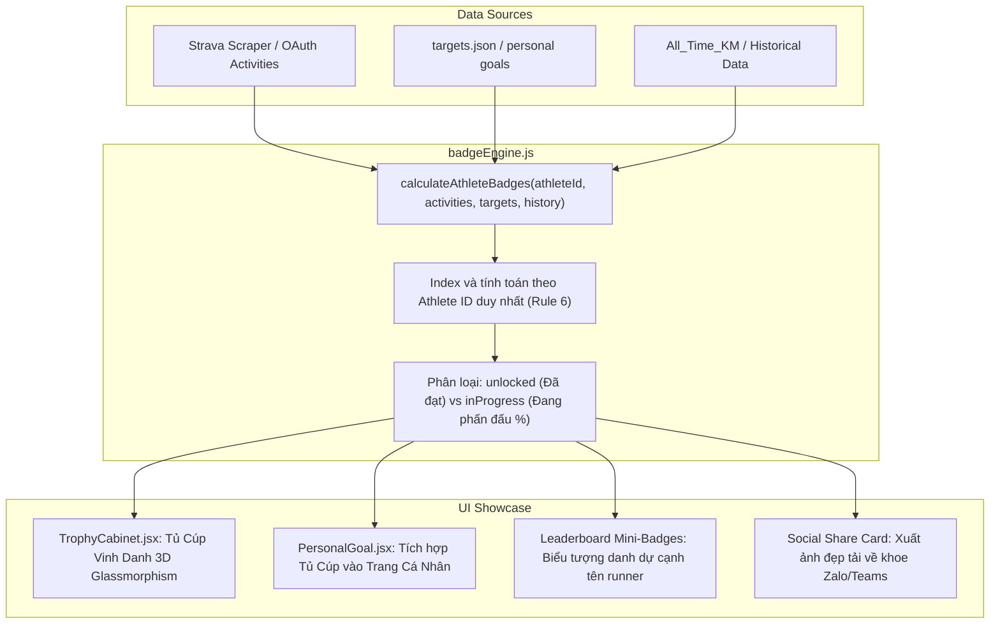

# Kế Hoạch Triển Khai: Hệ Thống Huy Hiệu & Thành Tích Cá Nhân (Haskoning Trophy Room & Gamification)

## 1. Giới thiệu & Mục Tiêu Dự Án
Dự án **Strava Desktop Software** (phiên bản Web & PC của CLB Chạy bộ Royal HaskoningDHV) đã sở hữu nền tảng quản lý bài tập và theo dõi mục tiêu vững chắc:
- Quản lý Mục tiêu cá nhân tháng & Cam kết nộp phạt kỷ luật (Personal Goal & Wallet Defense).
- Trợ lý AI Running Coach (Tư vấn thể lực, Garmin Training Status, Race Predictor VDOT).
- Bảng xếp hạng đường đua (Leaderboard, Top 3 Podium Cards, Bảng chi tiết).
- Hành trình thường niên công ty (Club Goal Progress: 6,000 km xuyên Việt).

**Mục tiêu của kế hoạch này:**
Biến các số liệu km khô khan thành trải nghiệm thể thao sống động, kích thích tinh thần rèn luyện, tạo niềm tự hào và sự gắn kết cho mọi người thông qua **"Tủ Cúp & Hệ Thống Huy Hiệu Vinh Danh Cá Nhân (Haskoning Trophy Room & Badges Gamification)"**.

---

## 2. Danh Mục 5 Nhóm Thành Tích & Huy Hiệu Đề Xuất

Tất cả huy hiệu được thiết kế theo cấp bậc (Đồng - Bạc - Vàng - Bạch Kim/Kim Cương), sử dụng bảng màu nhận diện thương hiệu Haskoning (`#002D54`, `#00A3A6`, `#78BE20`, `#0080A0`):

### Nhóm 1: Cột Mốc Cự Ly Đơn Lẻ (Single Run Milestones - "Bước Chân Vạn Dặm")
| Mã Huy Hiệu | Tên Tiếng Việt | Tên Tiếng Anh | Tiêu chí mở khóa (Threshold) | Cấp bậc & Biểu tượng |
| :--- | :--- | :--- | :--- | :--- |
| `milestone_5k` | **Tân Binh 5K** | *5K Finisher* | Hoàn thành 1 bài chạy đơn lẻ ≥ 5.0 km | 🥉 Đồng (`#CD7F32`) |
| `milestone_10k` | **Chiến Binh 10K** | *10K Warrior* | Hoàn thành 1 bài chạy đơn lẻ ≥ 10.0 km | 🥈 Bạc (`#C0C0C0`) |
| `milestone_21k` | **Chinh Phục Bán Marathon** | *Half-Marathon Hero* | Hoàn thành 1 bài chạy đơn lẻ ≥ 21.1 km | 🥇 Vàng (`#FFD700`) |
| `milestone_42k` | **Huyền Thoại Marathon** | *Marathon Legend* | Hoàn thành 1 bài chạy đơn lẻ ≥ 42.2 km | 👑 Kim Cương (`#00A3A6`) |

### Nhóm 2: Tích Lũy Tháng & Toàn Thời Gian (Volume & All-Time Legends)
| Mã Huy Hiệu | Tên Tiếng Việt | Tên Tiếng Anh | Tiêu chí mở khóa (Threshold) | Cấp bậc & Biểu tượng |
| :--- | :--- | :--- | :--- | :--- |
| `monthly_50k` | **Câu Lạc Bộ 50K** | *50K Bronze Club* | Tổng km chạy trong tháng hiện tại ≥ 50 km | 🥉 Đồng |
| `monthly_100k` | **Chiến Binh Bách Dặm (Centurion)** | *The Centurion (100K)* | Tổng km chạy trong tháng hiện tại ≥ 100 km | 🥈 Bạc |
| `monthly_150k` | **Siêu Nhân Bền Bỉ** | *Titanium Runner (150K)* | Tổng km chạy trong tháng hiện tại ≥ 150 km | 🥇 Vàng |
| `monthly_200k` | **Quái Kiệt Đường Chạy** | *The Beast (200K+)* | Tổng km chạy trong tháng hiện tại ≥ 200 km | ⚡ Bạch Kim |
| `alltime_500k` | **Đại Sứ 500K** | *500K Ambassador* | Tổng tích lũy lịch sử toàn thời gian ≥ 500 km | 💎 Kim Cương |
| `alltime_1000k`| **Huyền Thoại 1,000K** | *1,000K Legend* | Tổng tích lũy lịch sử toàn thời gian ≥ 1,000 km | 🏆 Tượng Đài |

### Nhóm 3: Kỷ Luật & Chuỗi Chạy (Streak & Consistency - "Ý Chí Thép")
| Mã Huy Hiệu | Tên Tiếng Việt | Tên Tiếng Anh | Tiêu chí mở khóa (Threshold) | Ý nghĩa thể thao |
| :--- | :--- | :--- | :--- | :--- |
| `streak_weeks_4` | **Ngọn Lửa Bền Bỉ** | *4-Week Consistency Flame* | Chạy liên tiếp 4 tuần (mỗi tuần ≥ 2 buổi chạy) | 🔥 Giữ thói quen không ngắt quãng |
| `weekend_warrior` | **Chiến Binh Cuối Tuần** | *Weekend Warrior* | Có bài chạy trong cả Thứ 7 và Chủ Nhật cùng 1 tuần | 🏖️ Vượt lười ngày nghỉ |
| `active_days_15` | **Chuyên Cần Vàng** | *15 Active Days* | Số ngày xỏ giày chạy trong tháng ≥ 15 ngày | 📅 50% số ngày trong tháng |
| `zero_penalty_3m` | **Lá Chắn Bất Bại** | *Iron Wallet (Zero Penalty)* | Tham gia phạt 3 tháng liên tiếp & đạt 100% mục tiêu | 🛡️ Kỷ luật thép, bảo vệ ví tiền 200k |
| `overachiever` | **Vượt Ngưỡng Kỳ Tích** | *Goal Overachiever* | Đạt ≥ 120% mục tiêu cá nhân đã đăng ký | 🚀 Vượt lên giới hạn bản thân |

### Nhóm 4: Phong Cách & Nhịp Sống (Lifestyle & Habits)
| Mã Huy Hiệu | Tên Tiếng Việt | Tên Tiếng Anh | Tiêu chí mở khóa (Threshold) | Ý nghĩa thể thao |
| :--- | :--- | :--- | :--- | :--- |
| `early_bird` | **Chim Sớm Haskoning** | *Early Bird Runner* | Có bài chạy bắt đầu trước 6:00 sáng | 🌅 Đón bình minh, sảng khoái trước giờ làm |
| `night_owl` | **Cú Đêm Xả Stress** | *Night Owl Runner* | Có bài chạy hoàn thành sau 20:00 tối | 🌙 Giải tỏa áp lực sau ngày dài công việc |
| `lunch_runner` | **Chân Chạy Giờ Nghỉ** | *Lunch Break Runner* | Có bài chạy trong khung 11:30 - 13:30 | ☀️ Tinh thần kiên cường |

### Nhóm 5: Tốc Độ & Kỹ Thuật (Speed & Performance)
| Mã Huy Hiệu | Tên Tiếng Việt | Tên Tiếng Anh | Tiêu chí mở khóa (Threshold) | Ý nghĩa thể thao |
| :--- | :--- | :--- | :--- | :--- |
| `sub30_5k` | **Tia Chớp 5K** | *Sub-30 5K* | Chạy 5km với thời gian < 30 phút (Pace < 6:00) | ⚡ Tốc độ bứt phá |
| `sub25_5k` | **Hỏa Tiễn 5K** | *Sub-25 5K Master* | Chạy 5km với thời gian < 25 phút (Pace < 5:00) | 🚀 Thể lực đỉnh cao |
| `pr_hunter` | **Kỷ Lục Gia** | *PR Hunter* | Hoạt động Strava ghi nhận phá kỷ lục cá nhân (`pr_count > 0`)| 🎯 Vượt qua chính mình |
| `hill_climber` | **Thợ Săn Dốc** | *Elevation Master* | Tích lũy độ cao leo dốc (Elevation Gain) ≥ 150m/tháng | ⛰️ Chinh phục dốc cầu / dốc trail |

---

## 3. Kiến Trúc Kỹ Thuật & Luồng Dữ Liệu

---

## 4. Tuân Thủ Nghiêm Ngặt Quy Tắc Hệ Thống (GEMINI.md)

1. **Rule 6 (Athlete ID Mandatory):**
   - Động cơ `badgeEngine.js` nhận `athleteId` làm khóa chính (Primary Key). Mọi bài chạy (`act.athlete.id`), lịch sử tích lũy và nợ phạt đều được đối chiếu bằng ID số duy nhất. Tên thành viên chỉ dùng cho mục đích hiển thị (Display Only).
2. **Rule 4 (Bilingual Parity & Full i18n):**
   - 100% tên huy hiệu, tiêu chí mở khóa, tooltip giải thích và thông báo đều được định nghĩa song ngữ trong `translations.js` (`vi` và `en`). Không hardcode đơn ngữ.
3. **Rule 3 (Haskoning Brand Palette & Unified Button Effects):**
   - Bảng màu: Navy `#002D54`, Teal `#00A3A6`, Lime Green `#78BE20`, Sky `#0080A0`.
   - Card huy hiệu dùng hiệu ứng Glassmorphism, viền sáng thương hiệu khi mở khóa, huy hiệu chưa đạt có màu kim loại mờ kèm progress bar viền Teal.
   - Nút bấm bo góc chuẩn 8-10px, hover nhấc 2px kèm bóng đổ phát sáng thương hiệu.
4. **Rule 7 (Pixel-Perfect Alignment & Uniform Spacing):**
   - Căn thẳng trục lề chuẩn 16px mép nội dung trên cả Desktop và Mobile. Không tràn viền, không cắt cụt chữ.

---

## 5. Lộ Trình Triển Khai Cụ Thể (Implementation Roadmap)

### Giai đoạn 1 (Cốt Lõi):
1. Xây dựng module `badgeEngine.js` tính toán 12 huy hiệu thiết thực nhất (Cột mốc cự ly đơn lẻ, tích lũy tháng 50K/100K, chuỗi chạy, chim sớm/cú đêm).
2. Xây dựng component `TrophyCabinet.jsx` hiển thị Tủ Cúp trực quan trong `PersonalGoal.jsx`.
3. Bổ sung từ khóa song ngữ vào `translations.js` và CSS styling vào `index.css`.
4. Viết script test `scratch/test_badge_engine.mjs` kiểm thử tự động 100% case.

### Giai đoạn 2 (Tương Tác & Lan Tỏa):
1. Hiển thị Mini-Badges danh dự cạnh tên runner trên Bảng xếp hạng (Leaderboard).
2. Pop-up chúc mừng pháo hoa khi vừa cán mốc huy hiệu mới sau khi Auto-sync Strava.
3. Thẻ chia sẻ thành tích (Social Share Card) để tải ảnh lưu niệm về khoe lên Zalo/Teams.

---
*Kế hoạch đã được lưu lại vĩnh viễn vào thư mục [Plans/](file:///c:/Users/926166/OneDrive%20-%20Haskoning/Tien_926166/Strava_Desktop_Software/Plans) để phục vụ cho các bước triển khai tiếp theo.*
