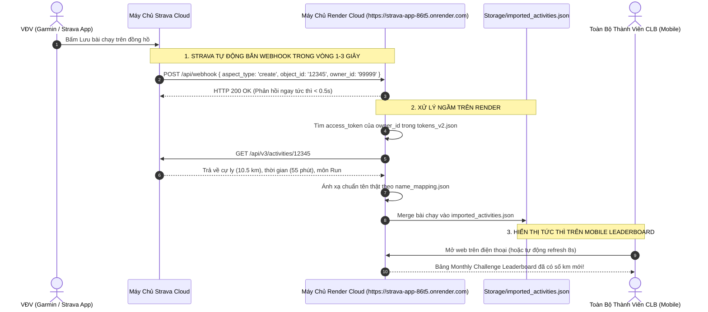

# KẾ HOẠCH TRIỂN KHAI: KÍCH HOẠT STRAVA WEBHOOK TỰ ĐỘNG ĐẨY SỰ KIỆN REAL-TIME

Tài liệu này chi tiết hóa kế hoạch kích hoạt tính năng **Strava Webhook Push Subscriptions**, giúp tự động cập nhật số km chạy bộ lên Cloud Render và bảng **Monthly Challenge Leaderboard** ngay khi thành viên kết thúc bài chạy mà **không cần bất kỳ ai phải mở web hay bấm nút**.

---

## 1. Xác Nhận Mindset (Kiểm Tra Có Đúng Kỳ Vọng Của Bạn Không)

### 🎯 Kỳ vọng của bạn:
> *"Khi một người chạy xong, dữ liệu hoạt động đó của họ sẽ tự động đồng bộ lên bảng Monthly Challenge Leaderboard trên giao diện mobile, và mọi người có thể xem được dữ liệu đó trên mobile mà không cần người đó phải mở web."*

👉 **ĐÂY CHÍNH XÁC LÀ BẢN CHẤT CỦA STRAVA WEBHOOK!**
- **Trước khi có Webhook (Hiện tại):** Chạy xong $\rightarrow$ Phải mở link Render trên điện thoại thì web mới kích hoạt lệnh kéo bài chạy về. Nếu người chạy đi ngủ mà không mở web thì bảng xếp hạng chưa có km mới.
- **Sau khi có Webhook (Mục tiêu mới):** Chạy xong $\rightarrow$ Bấm nút "Lưu" (Save) trên đồng hồ Garmin / Coros / Apple Watch hoặc app Strava $\rightarrow$ Trong vòng **1 - 3 giây**, Strava tự động "bắn" thông báo Webhook về Server Render $\rightarrow$ Render tự động nạp bài chạy vào bảng xếp hạng chung $\rightarrow$ Cả câu lạc bộ mở điện thoại lên là thấy số km mới ngay lập tức!

---

## 2. Các Quy Tắc Cốt Lõi Cần Thống Nhất Về Mặt Kỹ Thuật

Để Webhook hoạt động ổn định và chính xác, cần đáp ứng 3 điều kiện:

### Quy Tắc 1: Người Chạy Phải Đã Từng Bấm "Đăng Nhập Strava" 1 Lần Duy Nhất
* **Vì sao?** Strava Webhook chỉ gửi một gói tin thông báo ngắn (gồm ID người chạy và ID bài chạy). Server Render cần có mã `access_token` của người đó để gọi lại Strava lấy cự ly và thời gian.
* **Hành động của thành viên:** Mỗi thành viên chỉ cần mở web trên điện thoại bấm nút "Đăng nhập Strava" đúng **1 lần đầu tiên** khi tham gia giải. Sau đó, họ không bao giờ cần mở lại trang đăng nhập nữa, cứ xách đồng hồ đi chạy là tự động nhảy km.

### Quy Tắc 2: Máy Chủ Render Phải Thức 24/7 (Bắt buộc dùng UptimeRobot)
* **Vì sao?** Strava quy định Server nhận webhook **phải phản hồi mã HTTP 200 OK trong vòng 2 GIÂY**. Nếu máy chủ Render miễn phí bị "ngủ đông" (sau 15 phút không ai vào), nó sẽ mất 30-50 giây để khởi động lại $\rightarrow$ Strava sẽ báo lỗi Timeout và hủy gửi bài chạy.
* **Giải pháp:** Cài đặt UptimeRobot (hoàn toàn miễn phí, chỉ mất 3 phút) ping link Render mỗi 10 phút một lần để Render luôn luôn thức và tiếp nhận Webhook tức thì.

### Quy Tắc 3: Thành Viên Chưa Đăng Nhập Vẫn Được Backup Bởi Bản PC
* Đối với những thành viên trong CLB chưa kịp đăng nhập vào web, Admin chỉ cần mở phần mềm PC bấm nút **"Auto sync Strava"** như thường lệ để cào bổ sung.

---

## 3. Kiến Trúc Kỹ Thuật Triển Khai (Technical Flow)

---

## 4. Kế Hoạch Các Bước Thực Hiện Chi Tiết

### Bước 1: Bổ Sung Endpoint Tiếp Nhận Webhook Trên Server ([server/index.js](file:///c:/Users/926166/OneDrive%20-%20Haskoning/Tien_926166/Strava_Desktop_Software/server/index.js))
Xây dựng 2 API:
1. `GET /api/webhook`: Dùng để xác thực với Strava khi đăng ký.
   - Nhận `hub.challenge` và `hub.verify_token` từ Strava.
   - Kiểm tra mã bảo mật, trả về đúng `{ "hub.challenge": "..." }`.
2. `POST /api/webhook`: Dùng để tiếp nhận sự kiện bài chạy mới.
   - Trả về ngay `res.status(200).json({ received: true })` (dưới 0.5 giây).
   - Gọi hàm xử lý ngầm `handleStravaWebhookEvent(event)`:
     - Đọc `object_id` (mã bài chạy) và `owner_id` (mã VĐV).
     - Lấy thông tin bài chạy từ Strava API $\rightarrow$ Lọc bài chạy bộ (`Run`, `TrailRun`) $\rightarrow$ Chuẩn hoá tên theo `AthleteID_Name.csv` $\rightarrow$ Hợp nhất vào file `Storage/imported_activities.json`.

### Bước 2: Thiết Lập Biến Môi Trường Trên Render
Vào Dashboard quản lý của Render, thêm biến bảo mật:
- `STRAVA_VERIFY_TOKEN = STRAVA_RENDER_WEBHOOK_2026`

### Bước 3: Viết Script Đăng Ký Webhook Với Strava ([server/manage_webhook.cjs](file:///c:/Users/926166/OneDrive%20-%20Haskoning/Tien_926166/Strava_Desktop_Software/server/manage_webhook.cjs))
Tạo script công cụ chạy dòng lệnh giúp Admin:
- Kiểm tra danh sách Webhook hiện tại (`GET https://www.strava.com/api/v3/push_subscriptions`).
- Đăng ký Webhook mới (`POST https://www.strava.com/api/v3/push_subscriptions`) trỏ về URL: `https://strava-app-86t5.onrender.com/api/webhook`.
- Xóa Webhook cũ nếu cần cấu hình lại.

### Bước 4: Đẩy Code Lên Render & Đăng Ký Webhook
1. Chạy file `Push_To_Render_Cloud.bat` để Render tự động build bản cập nhật mới nhất.
2. Chạy lệnh đăng ký webhook từ máy tính: `node server/manage_webhook.cjs view` và `node server/manage_webhook.cjs create`.

### Bước 5: Kiểm Thử & Nghiệm Thu (Verification)
1. Dùng điện thoại của bạn mở app Strava, tạo 1 bài chạy thử nghiệm thủ công ("Add Manual Activity" 1.0 km Run).
2. Kiểm tra log trên Render xem có nhận được gói tin `POST /api/webhook` hay không.
3. Mở bảng xếp hạng trên điện thoại kiểm tra xem số km có tự động nhảy lên mà không cần phải bấm nút nào hay không.

---

## 5. Kết Luận
Kế hoạch này **khớp 100% với mong muốn của bạn**. Nó biến hệ thống từ chế độ "phải mở web để kích hoạt" trở thành hệ thống **Real-time Event-Driven hoàn toàn tự động**: Chạy xong $\rightarrow$ Đồng hồ lưu $\rightarrow$ Bảng xếp hạng trên Mobile tự động cập nhật ngay lập tức.
