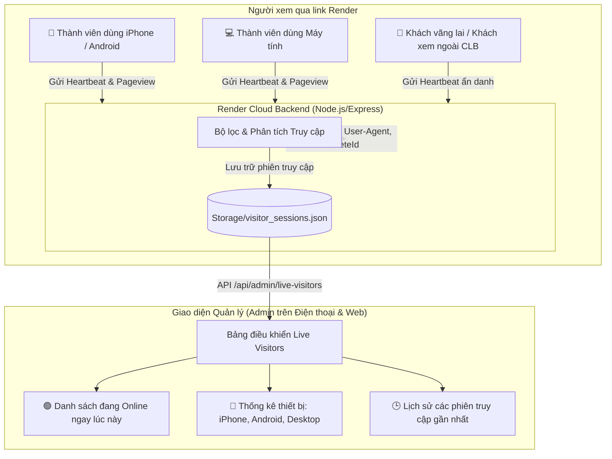

# Kế hoạch Tính năng: Quản Lý Người Truy Cập Render Trên Giao Diện Điện Thoại

Tài liệu này trình bày giải pháp kỹ thuật và kế hoạch xây dựng tính năng **Giám sát & Quản lý lượt truy cập (Live Visitor Tracking & Mobile Analytics)**, giúp Admin biết chính xác **ai đang vào xem dự án qua đường link Render trên điện thoại hoặc máy tính**.

---

## 1. Xác nhận cách hiểu yêu cầu của bạn (Understanding Intent)

Từ câu hỏi của bạn:
> *"chúng ta có thể quản lý xem ai đang vào xem dự án không qua đường link render, qua giao diện trên điện thoại. Nếu được thì lên plaan để xem bạn có hiểu ý mình hay không"*

Chúng ta hoàn toàn **CÓ THỂ** và **LÀM ĐƯỢC RẤT TỐT** tính năng này! Cách hiểu chi tiết như sau:

1. **Mục tiêu chính**:
   - Khi bạn chia sẻ đường link web Render (ví dụ: `https://strava-app-86t5.onrender.com/` hoặc link xem Leaderboard), bạn muốn biết:
     - **Ai đang vào xem?** (Tên thành viên nếu đã đăng nhập Strava, hoặc đánh dấu là "Khách xem #..." nếu vào ẩn danh).
     - **Vào bằng thiết bị gì?** (Điện thoại iPhone, Android, hay Máy tính, Tablet).
     - **Ai đang Online trực tiếp ngay lúc này?** (Realtime / Vừa truy cập vài phút trước).
     - **Họ đang xem trang nào?** (Bảng xếp hạng, Dashboard cá nhân,...).
2. **Trải nghiệm trên điện thoại (Mobile UX)**:
   - Hệ thống phát hiện chính xác người truy cập bằng thiết bị di động (Mobile / Tablet).
   - Bản thân bạn (Admin) có thể **mở điện thoại lên, vào mục Quản lý và xem danh sách người đang truy cập một cách trực quan, mượt mà và gọn gàng** mà không cần phải mở máy tính.

---

## 2. Kiến trúc giải pháp kỹ thuật (Technical Architecture)

### Chi tiết các tầng xử lý:

### 1. Tầng Client (Frontend Tracking Service)
- **Cơ chế Heartbeat (Nhịp tim) nhẹ & không ảnh hưởng hiệu năng**:
  - Khi mở web (bất kể qua điện thoại hay máy tính), frontend tự động gửi một gói tin ping nhẹ (khoảng vài chục bytes) mỗi 30 - 45 giây.
  - Gói tin chứa:
    - `visitorId`: Mã định danh phiên (UUID lưu trong `localStorage` để đếm chính xác số người duy nhất, không bị trùng).
    - `athleteId`, `athleteName`, `avatar`: Nếu là thành viên đã đăng nhập Strava. Nếu chưa đăng nhập $\rightarrow$ Đánh dấu "Khách xem (Guest)".
    - `deviceType`: Phân loại `Điện thoại (iPhone/Android)` hoặc `Máy tính`.
    - `browser`: Safari, Chrome, Zalo Browser, Facebook In-app Browser, Edge,...
    - `currentPage`: Trang hiện tại (`/`, `/leaderboard`,...).

### 2. Tầng Server (Render Express Backend)
- **Endpoint nhận Heartbeat**: `POST /api/analytics/heartbeat`
- **Endpoint lấy báo cáo cho Admin**: `GET /api/admin/live-visitors` (Chỉ Admin mới có quyền xem).
- **Phát hiện địa chỉ mạng & vị trí**: Đọc IP từ header `x-forwarded-for` (chuẩn của Render Cloud).
- **Quản lý trạng thái Realtime**:
  - Nếu phiên gửi heartbeat trong vòng **3 phút gần nhất** $\rightarrow$ Đánh dấu là 🟢 **Đang Trực Tuyến (Online Now)**.
  - Nếu quá 3 phút $\rightarrow$ Đánh dấu là ⚪ **Đã rời đi (Offline)** kèm thời gian xem cuối.
- **Bảo toàn dữ liệu nhẹ & tối ưu**: Lưu trữ tại `Storage/visitor_sessions.json`, tự động giữ tối đa 200 lượt gần nhất và thống kê theo ngày (không làm nặng bộ nhớ server Render).

### 3. Giao diện Quản trị trên Điện thoại (Mobile-First Admin UI)
Trong trang Quản trị (`/administer`), bổ sung Tab **"Người Dùng Truy Cập (Live Visitors)"**:
- **3 Thẻ Thống Kê Tổng Quan Đầu Trang (KPI Cards)**:
  - 🟢 **Đang Trực Tuyến (Live Now)**: Số lượng người đang mở web xem lúc này.
  - 📱 **Lượt Xem Qua Điện Thoại Hôm Nay**: Số lượt dùng iPhone / Android.
  - 👥 **Tổng Lượt Truy Cập Hôm Nay**: Tổng số lượt xem trong ngày.
- **Danh sách Trực Quan dạng Thẻ (Cards List) tối ưu 100% cho màn hình điện thoại**:
  - Avatar người dùng (nếu có) hoặc icon điện thoại/laptop.
  - Tên thành viên (hoặc `Khách #...`).
  - Huy hiệu thiết bị: `📱 iPhone 15 Pro (Safari)` hoặc `📱 Samsung Galaxy (Chrome Mobile)`.
  - Huy hiệu trạng thái: 🟢 `Đang xem: Bảng xếp hạng CLB` (nhấp nháy xanh) hoặc `Rời đi 15 phút trước`.
  - Địa chỉ IP rút gọn và thời điểm bắt đầu / kết thúc xem.
- **Nút Tự Động Làm Mới (Auto-Refresh Toggle)**: Cứ mỗi 15 giây tự cập nhật danh sách để bạn để điện thoại một chỗ vẫn theo dõi được ai đang vào.

---

## 3. Các bước triển khai (Implementation Steps)

### Backend ([server/index.js](file:///c:/Users/926166/OneDrive%20-%20Haskoning/Tien_926166/Strava_Desktop_Software/server/index.js))
- Khởi tạo file lưu trữ `Storage/visitor_sessions.json`.
- Thêm API `POST /api/analytics/heartbeat` để tiếp nhận tín hiệu từ link Render.
- Thêm API `GET /api/admin/live-visitors` để trích xuất thống kê và danh sách phiên.
- Thêm API `DELETE /api/admin/live-visitors` cho phép Admin dọn sạch lịch sử cũ nếu muốn.

### Frontend Tracking Helper ([frontend/src/services/visitorTracker.js](file:///c:/Users/926166/OneDrive%20-%20Haskoning/Tien_926166/Strava_Desktop_Software/frontend/src/services/visitorTracker.js))
- Xây dựng module nhận diện thiết bị (`isMobile`, `os`, `browser`), tạo `visitorId` ẩn danh, và khởi chạy heartbeat định kỳ gửi về server Render.
- Tích hợp vào `App.jsx` để tự động chạy nền khi người xem truy cập bất kỳ trang nào.

### Giao diện Quản trị ([frontend/src/pages/Administer.jsx](file:///c:/Users/926166/OneDrive%20-%20Haskoning/Tien_926166/Strava_Desktop_Software/frontend/src/pages/Administer.jsx))
- Thêm Tab mới **"Truy cập & Thiết bị (Visitors)"** với biểu tượng `Radio` / `Smartphone`.
- Thiết kế layout chuẩn mobile-friendly, card layout responsive và auto-refresh.

---

## 4. Kế hoạch xác minh & kiểm thử (Verification Plan)

1. **Kiểm tra phát hiện thiết bị di động**:
   - Mở giao diện bằng chế độ Responsive Mobile (iPhone/Android DevTools) -> Kiểm tra gói tin heartbeat có gắn cờ `isMobile: true` và tên hệ điều hành chính xác.
2. **Kiểm tra trạng thái Realtime**:
   - Mở một tab web ở chế độ Khách -> Tab Admin hiển thị ngay 1 người đang 🟢 Online.
   - Đóng tab khách -> Sau 3 phút chuyển sang trạng thái Offline.
3. **Kiểm tra trên link Render thực tế**:
   - Sau khi hoàn thành, dùng script `Push_To_Render_Cloud.bat` để đẩy mã nguồn lên Render.
   - Mở điện thoại thật truy cập đường link Render -> Vào trang Quản trị kiểm tra danh sách thấy ngay thiết bị điện thoại của mình xuất hiện.
