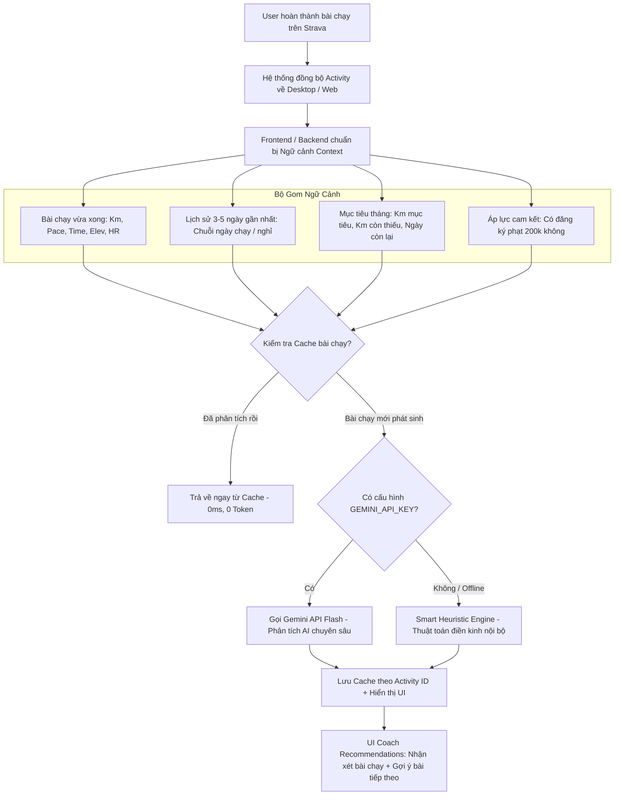

# Kế Hoạch Tích Hợp AI Agent Tự Động Phân Tích Hoạt Động Chạy Bộ (AI Coach Recommendations)

## 1. Hiện Trạng Của Coach Recommendations Hiện Tại

Qua rà soát toàn bộ mã nguồn ([PersonalGoal.jsx](file:///c:/Users/926166/OneDrive%20-%20Haskoning/Tien_926166/Strava_Desktop_Software/frontend/src/components/PersonalGoal.jsx#L331-L375)), mục **Coach Recommendations** ("Tư vấn & Kế hoạch") hiện tại đang sử dụng **bộ quy tắc tĩnh (Rule-based Templates)** và chỉ có **chính xác 6 kịch bản/nội dung cố định**:

| STT | Tình huống | Loại thông báo | Nội dung Tiếng Việt | Nội dung Tiếng Anh |
| :--- | :--- | :--- | :--- | :--- |
| **1** | Chưa đặt mục tiêu (`goal <= 0`) | `info` (Xanh dương) | *Hãy thiết lập mục tiêu tháng để nhận tư vấn và kế hoạch tập luyện cá nhân hóa!* | *Set a monthly goal to get personalized coaching and training plans!* |
| **2** | Đã hoàn thành mục tiêu (`isGoalReached`) | `success` (Xanh lá) | *Tuyệt vời! Bạn đã đạt mục tiêu tháng này. Hãy nghỉ ngơi phục hồi hoặc đặt thêm một mục tiêu phụ (stretch goal) nhé.* | *Incredible! You reached your goal. Take some rest or push for a stretch goal.* |
| **3** | Xem tháng cũ trong quá khứ (`isPastMonth`) | `info` (Xanh dương) | *Tháng này đã kết thúc. Chúc bạn có những thành tích tốt hơn trong tương lai!* | *This month has ended. Wish you better achievements in the future!* |
| **4** | Xem tháng trong tương lai (`isFutureMonth`) | `info` (Xanh dương) | *Tháng này chưa bắt đầu. Hãy lên kế hoạch tập luyện sẵn sàng nhé!* | *This month hasn't started yet. Get ready!* |
| **5** | Đang kịp/vượt tiến độ (`current% >= expected%`) | `success` (Xanh lá) | *Làm tốt lắm! Bạn đang đi đúng tiến độ. Cứ giữ nhịp độ tối thiểu {X} km/ngày, bạn sẽ hoàn thành mục tiêu dễ dàng.* | *Great job! You are on track. Maintain at least {X} km/day to hit your goal easily.* |
| **6** | Đang chậm hơn tiến độ (`current% < expected%`) | `warning` (Vàng cam) | *Bạn đang chậm hơn tiến độ dự kiến. Cần chạy trung bình {X} km/ngày trong {Y} ngày còn lại. Hãy sắp xếp thời gian nhé!* | *You're slightly behind schedule. You need to run {X} km/day for the remaining {Y} days. You can do it!* |

> [!NOTE]
> **Nhận xét điểm giới hạn hiện tại:**
> - Các thông điệp này hoàn toàn là công thức toán học cơ bản (lấy `remainingKm / daysLeft`), chưa đọc dữ liệu từng bài chạy thực tế.
> - Runner chạy 15km pace nhanh kỷ lục hay chạy 2km đi bộ thì thông điệp vẫn chỉ tính theo tổng km lũy kế.
> - Không nhận diện được mệt mỏi, tần suất liên tục (nguy cơ chấn thương) hay bài tập hồi phục (recovery run).

---

## 2. Giải Pháp: Tích Hợp "AI Running Coach Agent" Tự Động Phân Tích Theo Từng Hoạt Động

> [!TIP]
> Việc tích hợp **AI Agent** vào khu vực này là **hoàn toàn khả thi và cực kỳ tiềm năng**. Tính năng này sẽ biến ứng dụng từ một bảng thống kê số liệu khô khan thành một **Huấn luyện viên điền kinh cá nhân thông minh**.

### 2.1. Kiến Trúc Hoạt Động Của AI Agent

### 2.2. Dữ Liệu Ngữ Cảnh (Context) Gửi Vào AI Agent
Mỗi khi runner có hoạt động mới, AI Agent sẽ nhận được dữ liệu súc tích:
1. **Thông tin bài chạy gần nhất:**
   - Cự ly (km), Thời gian di chuyển (moving time), Pace thực tế (ví dụ: 6:15 /km).
   - Nhịp tim trung bình/tối đa (nếu thiết bị ghi nhận).
   - Độ cao leo dốc (elevation gain) để biết bài chạy dốc hay đường bằng.
2. **Xu hướng vận động (Trends):**
   - Runner đã chạy liên tiếp mấy ngày (ví dụ: chạy 3 ngày liên tục -> AI cảnh báo cần ngày nghỉ ngơi phục hồi - Rest day).
   - Runner vừa nghỉ cách quãng bao nhiêu ngày (ví dụ: đã nghỉ 4 ngày liên tiếp -> AI nhắc nhở khởi động nhẹ nhàng tránh chấn thương).
   - So sánh Pace bài vừa rồi với Pace trung bình tháng (Nhanh hơn bất thường? Hay dấu hiệu mệt mỏi?).
3. **Mục tiêu cá nhân & Áp lực quỹ CLB:**
   - Mục tiêu tháng ({goal} km), số km còn thiếu, số ngày còn lại.
   - Có tham gia cam kết phạt 200k hay không.

### 2.3. Cấu Trúc Phản Hồi Của AI Coach (4 Trọng Tâm Cá Nhân Hóa)
AI sẽ phản hồi ngắn gọn trong 2-3 câu súc tích (phù hợp với kích thước card giao diện), bao quát 4 tình huống trọng tâm:
1. **Phân tích bài tập vừa hoàn thành:** Khen ngợi nỗ lực hoặc đánh giá hiệu quả (ví dụ: *"Tuyệt vời! Bài chạy dài 10.1km sáng nay của bạn duy trì nhịp độ rất đều, giúp bạn bù đắp được khoảng cách mục tiêu."*).
2. **Cảnh báo thể lực / Trạng thái hồi phục:** Nhận diện runner vừa chạy liên tiếp nhiều ngày (ví dụ: *"Bạn đã vận động với cường độ cao 3 ngày liên tục, cơ bắp cần thời gian tái tạo."*).
3. **Gợi ý bài tập tiếp theo (Next Workout Action):** Đưa ra cự ly và pace tham khảo cụ thể (ví dụ: *"Ngày mai hãy dành trọn vẹn để nghỉ ngơi hoặc đi bộ nhẹ nhàng 2km nhé!"* hoặc *"Ngày mai chạy nhẹ 4-5km pace 7:30 là vừa đẹp để duy trì nhịp thở."*).
4. **Cảnh báo nghỉ hoạt động quá lâu (Inactivity Alert - Đang lười/ngắt quãng):**
   - **Điều kiện kích hoạt:** Khi runner không có hoạt động chạy nào trong $\ge 3$ đến $5+$ ngày gần nhất (hoặc đang giữa tháng mà số ngày nghỉ kéo dài khiến mục tiêu bị đe dọa).
   - **Nội dung cảnh báo & thúc đẩy tinh thần:**
     + *Nhắc nhở kịp thời:* (ví dụ: *"Đã 4 ngày rồi bạn chưa xỏ giày ra đường! Tiến độ tháng đang có nguy cơ bị chậm lại. Hãy khởi động lại ngay hôm nay với một bài chạy nhẹ 2-3km thả lỏng nhé!"*).
     + *Cảnh báo an toàn chấn thương:* Nhắc nhở runner **không chạy dồn ép quá mức để "bù" những ngày đã nghỉ**, tránh chấn thương khớp gối/cơ bắp sau chuỗi ngày nghỉ dài.
     + *Nhắc nhở áp lực quỹ:* Nếu có cam kết phạt 200k, AI sẽ cảnh báo nguy cơ bị nộp phạt vào cuối tháng nếu không tái khởi động kịp thời.

### 2.4. Cơ Chế Caching Chống Tốn Token & Tự Động Kích Hoạt Cảnh Báo Nghỉ Dài Ngày
- Lưu cache kết quả AI theo `latest_activity_id` + `current_date` của từng runner vào file `Storage/ai_coach_cache.json`.
- **Cơ chế phân biệt thông minh:**
  1. *Khi vừa có bài chạy mới:* Tự động kích hoạt phân tích bài tập mới (Trọng tâm 1, 2, 3).
  2. *Khi không chạy nhiều ngày (Inactivity):* Nếu ngày hôm nay cách bài chạy gần nhất $\ge 3$ ngày, cache ngày hôm trước sẽ hết hạn và AI tự động tạo thông điệp **Cảnh báo nghỉ quá lâu (Trọng tâm 4)** để đón runner khi họ mở ứng dụng.
- **Tiết kiệm 100% token thừa:** Khi đã tạo lời khuyên cho ngày hôm đó (cùng ngày & cùng bài chạy gần nhất), mọi thao tác reload trang đều lấy trực tiếp từ cache trong 0ms.
- Runner luôn có thể chủ động bấm nút icon xoay tròn **"Làm mới tư vấn AI"** bất kỳ lúc nào.

---

## 3. Các Thay Đổi Kỹ Thuật Đề Xuất (Proposed Changes)

### Backend (`server/`)
#### [NEW] [ai_coach_service.js](file:///c:/Users/926166/OneDrive%20-%20Haskoning/Tien_926166/Strava_Desktop_Software/server/ai_coach_service.js)
- Xây dựng module AI Coach Service:
  - Tích hợp Google Gemini API (model `gemini-1.5-flash` hoặc `gemini-2.0-flash` tốc độ cao, miễn phí).
  - Hàm tạo prompt chuyên gia điền kinh dựa trên dữ liệu activities, mục tiêu, streak.
  - Quản lý đọc/ghi cache `Storage/ai_coach_cache.json`.
  - Bộ thuật toán Fallback dự phòng (Smart Heuristic Coach) khi không có Internet hoặc chưa nhập API Key.

#### [MODIFY] [server/index.js](file:///c:/Users/926166/OneDrive%20-%20Haskoning/Tien_926166/Strava_Desktop_Software/server/index.js)
- Bổ sung endpoint API:
  - `POST /api/ai/coach-advice`: Nhận thông tin runner và trả về phân tích cá nhân hóa (đã qua cache).
  - `POST /api/ai/coach-advice/refresh`: Bắt buộc phân tích lại (bypass cache).

#### [MODIFY] [.env](file:///c:/Users/926166/OneDrive%20-%20Haskoning/Tien_926166/Strava_Desktop_Software/.env)
- Thêm biến môi trường: `GEMINI_API_KEY=...` (hướng dẫn user lấy key miễn phí từ Google AI Studio trong 1 phút).

### Frontend (`frontend/src/`)
#### [MODIFY] [frontend/src/components/PersonalGoal.jsx](file:///c:/Users/926166/OneDrive%20-%20Haskoning/Tien_926166/Strava_Desktop_Software/frontend/src/components/PersonalGoal.jsx)
- Cập nhật khối `Coach Recommendations`:
  - Thêm badge **"AI Powered"** với hiệu ứng lấp lánh nhẹ nhàng.
  - Gọi API `/api/ai/coach-advice` tự động khi mở thẻ cá nhân.
  - Hiển thị skeleton loading thanh lịch khi AI đang tạo lời khuyên.
  - Thêm nút nhỏ "Tạo lại tư vấn" (Refresh advice) cạnh tiêu đề.
  - Hiển thị phân đoạn rõ ràng: `[Đánh giá bài chạy gần nhất]` • `[Lời khuyên bài tập tiếp theo]`.

#### [MODIFY] [frontend/src/index.css](file:///c:/Users/926166/OneDrive%20-%20Haskoning/Tien_926166/Strava_Desktop_Software/frontend/src/index.css)
- Tinh chỉnh CSS cho `ai-coach-box`: thêm hiệu ứng gradient viền tinh tế, nút refresh nhỏ, animation mượt mà chuẩn giao diện cao cấp.

---

## 4. Kế Hoạch Kiểm Thử (Verification Plan)

Tuân thủ nghiêm ngặt quy tắc tại [GEMINI.md](file:///c:/Users/926166/OneDrive%20-%20Haskoning/Tien_926166/Strava_Desktop_Software/GEMINI.md):
1. **Unit Test Backend:**
   - Tạo script kiểm thử `scratch/test_ai_coach.mjs` để test các kịch bản:
     + Kịch bản có API Key (gọi Gemini Flash thành công, trả về JSON chuẩn).
     + Kịch bản không có API Key hoặc lỗi mạng (Smart Heuristic Fallback hoạt động trơn tru).
     + Kiểm tra cơ chế Cache (gọi lần 2 trả về ngay lập tức từ file cache).
2. **Build & Syntax Test:**
   - Chạy `npm run build` trong `frontend` đảm bảo không có lỗi biên dịch Vite/React 19.
3. **Báo cáo trung thực 100%:**
   - Cung cấp log kết quả test case chi tiết trước khi hoàn tất.
