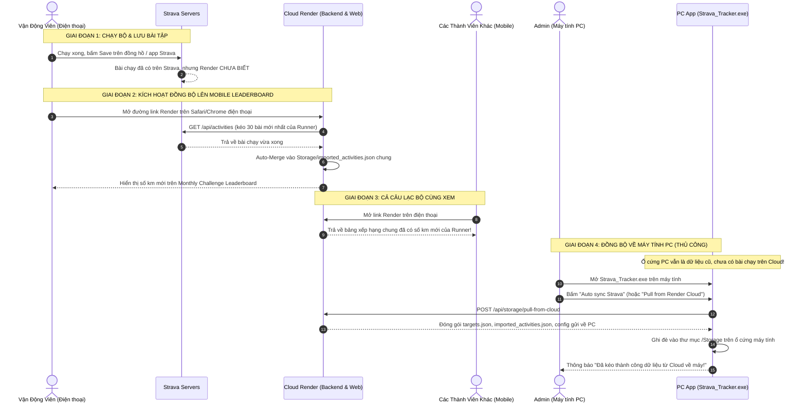

# KẾ HOẠCH & BÁO CÁO KỸ THUẬT: XÁC NHẬN CƠ CHẾ ĐỒNG BỘ DỮ LIỆU STRAVA -> MOBILE -> PC

Tài liệu này xác nhận và làm rõ chính xác câu hỏi của bạn về cơ chế lấy dữ liệu từ Strava, thời điểm dữ liệu xuất hiện trên bảng **Monthly Challenge Leaderboard (Mobile)**, và vì sao **Phiên bản PC** bắt buộc phải do Admin kéo dữ liệu về máy theo kiến trúc hiện tại của dự án.

---

## 1. Xác Nhận Trực Diện 2 Câu Hỏi Của Bạn (Fact-Check)

### Câu hỏi 1: "Khi một người chạy xong, dữ liệu sẽ tự đồng bộ lên bảng Monthly Challenge Leaderboard trên mobile và mọi người đều xem được đúng không?"
👉 **XÁC NHẬN: ĐÚNG, NHƯNG CÓ ĐIỀU KIỆN KÍCH HOẠT (TRIGGER).**
- Dữ liệu **không thể tự động bay từ đồng hồ lên Render ngay khi vừa bấm Save** (vì hiện tại hệ thống chưa cấu hình Strava Webhook ngầm).
- Thay vào đó, **điều kiện kích hoạt là: Người chạy chỉ cần mở đường link Render trên điện thoại của họ** (với tài khoản đã đăng nhập Strava).
- Ngay khi người đó vừa mở link Render:
  1. Trình duyệt gửi lệnh `GET /api/activities` lên Render.
  2. Server Render dùng token của người đó gọi Strava API lấy bài chạy mới nhất.
  3. Server Render **tự động merge (hợp nhất) bài chạy này vào file `Storage/imported_activities.json` chung của cả CLB**.
  4. Ngay lập tức, bảng **Monthly Challenge Leaderboard** trên Mobile cộng thêm số km mới, và **TẤT CẢ các thành viên khác trong CLB khi mở điện thoại đều nhìn thấy số km mới này**.

*(Lưu ý: Nếu người chạy đó chạy xong nhưng KHÔNG mở link web, thì bài chạy đó vẫn nằm trên máy chủ Strava. Nó sẽ chỉ xuất hiện trên bảng xếp hạng khi Admin trên PC bấm "Auto sync Strava" để cào dữ liệu toàn câu lạc bộ).*

---

### Câu hỏi 2: "Còn phiên bản PC thì phải Admin kéo dữ liệu về máy chứ không thể auto sync được đúng không?"
👉 **XÁC NHẬN: ĐÚNG 100% THEO KIẾN TRÚC HIỆN TẠI.**
- Phiên bản PC chạy độc lập trong mạng máy tính nội bộ của Admin, lưu trữ dữ liệu tại thư mục `Storage/` trên ổ cứng máy tính cá nhân.
- Khi các thành viên chạy bộ ngoài đường và đẩy dữ liệu lên Cloud Render (hoặc Sub-Admin dùng điện thoại tick phạt, sửa mục tiêu), dữ liệu đó mới chỉ nằm trên ổ cứng của Cloud Render.
- Máy tính PC ở nhà **không thể tự động kết nối ngầm để kéo dữ liệu về** nếu:
  1. Máy tính đang tắt hoặc Admin chưa mở phần mềm `Strava_Tracker.exe`.
  2. Admin chưa bấm nút kích hoạt trên giao diện.
- **Cơ chế kéo dữ liệu về PC hiện tại:**
  - **Cách 1 (Khuyên dùng):** Admin mở app PC, bấm nút **"Auto sync Strava"** ở thanh Sidebar. Trong mã nguồn ([`Sidebar.jsx:849-867`](file:///c:/Users/926166/OneDrive%20-%20Haskoning/Tien_926166/Strava_Desktop_Software/frontend/src/components/Sidebar.jsx#L849-L867)), nút này đã được lập trình sẵn để vừa cào bài chạy mới, vừa tự động gọi `POST /api/storage/pull-from-cloud` để kéo toàn bộ dữ liệu mới nhất từ Render về máy PC.
  - **Cách 2:** Vào trang **Quản trị (Administer)** -> Tab 4 (Quản trị dữ liệu) -> Bấm nút **"Kéo dữ liệu từ Cloud (Pull from Render Cloud)"**.

---

## 2. Sơ Đồ Luồng Dữ Liệu Chi Tiết (Step-by-Step Flow)

---

## 3. Bảng So Sánh Cơ Chế Hiện Tại và Các Điểm Nghẽn

| Tiêu Chí | Trên Điện Thoại (Mobile Web Render) | Trên Máy Tính (PC Desktop App) |
| :--- | :--- | :--- |
| **Nơi lưu trữ dữ liệu** | `Storage/` trên máy chủ Render Cloud | `Storage/` trên ổ cứng máy tính của Admin |
| **Cơ chế cập nhật bài chạy mới** | Tự động cập nhật bài của user **khi user đó mở web Render** trên điện thoại (qua `GET /api/activities`) | Không tự cập nhật nếu Admin không bấm nút |
| **Ai nhìn thấy bảng xếp hạng?** | Bất kỳ ai mở link Render đều thấy kết quả chung của cả CLB | Chỉ Admin ngồi trước màn hình máy tính thấy |
| **Thao tác để lấy dữ liệu mới nhất** | Chỉ cần mở trang web hoặc kéo vuốt để tải lại trang (Reload) | Phải bấm **"Auto sync Strava"** hoặc **"Pull from Render Cloud"** |
| **Nguy cơ tiềm ẩn** | Render Free Tier bị ngủ đông sau 15 phút không có ai vào $\rightarrow$ cần UptimeRobot đánh thức | Nếu Admin quên bấm "Pull" trước khi bấm "Push", có thể ghi đè dữ liệu cũ lên Cloud |

---

## 4. Quy Trình Vận Hành Chuẩn Dành Cho Admin Hàng Ngày

Để đảm bảo dữ liệu luôn khớp 100% giữa Điện thoại của mọi người và Máy tính của Admin:

1. **Ban ngày (Mọi người đi chạy & sinh hoạt):**
   - Các runner chạy xong, mở link Render xem số km của mình và của CLB.
   - Các Sub-Admin có thể mở điện thoại tick phạt hoặc kiểm tra tiến độ.
   - Mọi thao tác này đều đang lưu trên Cloud Render.

2. **Buổi tối (Admin mở máy tính PC tổng kết):**
   - **Bước 1:** Khởi động `Strava_Tracker.exe` (hoặc `START_APP.bat`).
   - **Bước 2:** Bấm nút **"Auto sync Strava"** ở Sidebar.
     *(Hệ thống sẽ cào các bài chạy của những người chưa từng vào web, sau đó tự động PULL toàn bộ dữ liệu từ Render về máy tính, rồi PUSH bản hoàn thiện nhất ngược lại lên Render).*
   - **Bước 3 (Tùy chọn an toàn tuyệt đối):** Chạy file `Push_To_Render_Cloud.bat` để lưu vĩnh viễn dữ liệu đó lên GitHub, phòng trường hợp Render khởi động lại máy chủ.

---

## 5. Đề Xuất Nâng Cấp Tự Động Hoá Hoàn Toàn (Khuyến Nghị Tương Lai)

Nếu bạn muốn biến hệ thống thành **tự động 100% không cần ai phải mở web hay bấm nút**:

1. **Triển khai Strava Webhook Push:**
   - Cấu hình endpoint `POST /api/webhook` trên Render như báo cáo `Plans/Strava_Webhook_Realtime_Sync_Report.md`.
   - VĐV chạy xong bấm Save trên đồng hồ Garmin/Coros $\rightarrow$ Strava tự "bắn" bài chạy về Render $\rightarrow$ Không cần runner phải mở web thì số km cũng tự nhảy trên Leaderboard.
2. **Đồng bộ thời gian thực PC <-> Mobile bằng Firebase / Cloud Database:**
   - Thay vì lưu các file `.json` riêng rẽ ở PC và Render, cả hai cùng cắm chung vào 1 Database thời gian thực (Firebase Realtime Database hoặc Supabase).
   - Khi đó, bất kỳ thay đổi nào trên Mobile sẽ lập tức hiện trên PC và ngược lại, **xóa bỏ hoàn toàn nhu cầu phải bấm nút "Pull from Cloud" thủ công**.
