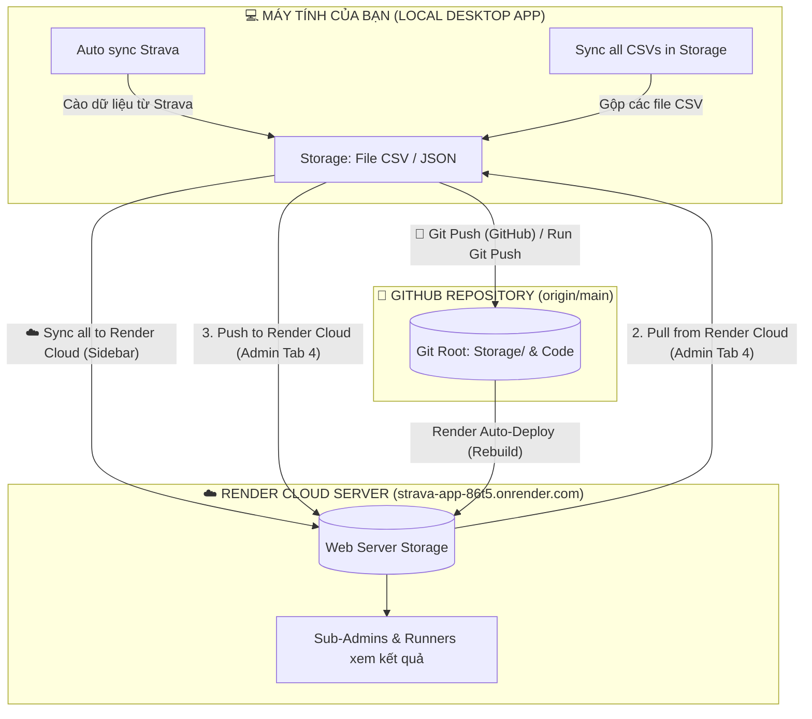

# HƯỚNG DẪN CHI TIẾT TÍNH NĂNG CÁC NÚT ĐỒNG BỘ DỮ LIỆU TRÊN STRAVA TRACKER

Tài liệu này giải thích chi tiết chức năng, cơ chế hoạt động, luồng dữ liệu và hướng dẫn sử dụng các nút đồng bộ dữ liệu (Data Management & Sidebar Sync) trong hệ thống **Strava Tracker** giữa **Desktop App (Local PC)**, **Render Cloud (Web Server)** và **GitHub**.

---

## 🗺️ SƠ ĐỒ TỔNG QUAN LUỒNG DỮ LIỆU

---

## 📌 CHI TIẾT TÍNH NĂNG TỪNG NÚT

### 1. Nhóm nút trong mục "2. Pull Data from Cloud" (Kéo Dữ Liệu Từ Cloud Về Máy)

#### 📥 Nút: `[ Pull from Render Cloud ]` *(Kéo Dữ Liệu Từ Cloud Về)*
* **Vị trí:** Tab 4 (Data Management) ➡️ Khung số 2.
* **Luồng dữ liệu:** `Render Cloud Server` ➡️ `Thư mục Storage/ trên Máy tính Local`
* **Cơ chế hoạt động:**
  * Gọi API `/api/storage/pull-from-cloud` kết nối trực tiếp đến web Render (`https://strava-app-86t5.onrender.com`).
  * Tải và ghi đè các tệp dữ liệu mới nhất vào máy tính gồm:
    * `imported_activities.json` (Danh sách toàn bộ hoạt động chạy bộ do Sub-Admin vừa cào/đồng bộ).
    * `targets.json` (Mục tiêu km và trạng thái đóng tiền phạt).
    * `challenge_config.json` (Cấu hình tháng, nhóm chạy, danh sách VĐV).
    * `admins.json` (Danh sách phân quyền Admin/Sub-Admin).
* **Khi nào nên dùng:**
  * Khi các **Sub-Admin khác** vừa cập nhật hoạt động hoặc điều chỉnh cấu hình trên trang web Render, và bạn (Super Admin) muốn kéo toàn bộ dữ liệu mới nhất đó về máy tính của mình.

#### 🚀 Nút: `[ Run Git Push ]` *(Nút nhỏ màu xanh lá nằm ngay dưới nút Pull)*
* **Vị trí:** Ngay dưới nút *Pull from Render Cloud*.
* **Luồng dữ liệu:** `Máy tính Local` ➡️ `GitHub Repository`
* **Cơ chế hoạt động:**
  * Chạy lệnh `git push origin main` đẩy các file dữ liệu vừa kéo về lên kho GitHub.
* **Khi nào nên dùng:**
  * Ngay sau khi bạn vừa bấm **Pull from Render Cloud** thành công. Bấm thêm nút này để lưu trữ vĩnh viễn dữ liệu của Sub-Admin vào GitHub, chống mất dữ liệu khi server Render khởi động lại.

---

### 2. Nhóm nút trong mục "3. Push Local Data to Cloud" (Đẩy Dữ Liệu Từ Máy Lên Cloud)

#### 📤 Nút: `[ Push to Render Cloud ]` *(Đẩy Lên Render Cloud Ngay)*
* **Vị trí:** Tab 4 (Data Management) ➡️ Khung số 3.
* **Luồng dữ liệu:** `Thư mục Storage/ trên Máy tính Local` ➡️ `Render Cloud Server (Trực tiếp qua API)`
* **Cơ chế hoạt động:**
  * Đóng gói toàn bộ file dữ liệu trên máy tính (`imported_activities.json`, `targets.json`, `admins.json`, `challenge_config.json`, `name_mapping.json`, `club_goal.json`) gửi thẳng tới endpoint `/api/storage/sync-bundle` của Render.
  * **Ưu điểm vượt trội:** Dữ liệu trên web Render được cập nhật ngay lập tức chỉ sau **1 – 2 giây**, **không cần phải chờ Render rebuild/redeploy server** (không tốn 3-5 phút chờ đợi).
* **Khi nào nên dùng:**
  * Khi bạn vừa cập nhật phân quyền Admin, đổi mục tiêu chạy, hoặc vừa cào dữ liệu mới trên máy tính và muốn **ngay lập tức** toàn bộ thành viên CLB khi mở web đều thấy số liệu mới.

---

### 3. Nhóm nút trong "Quick System Data Actions" (Tác vụ Nhanh Dữ liệu)

#### 🚀 Nút: `[ Git Push (GitHub) ]` *(Git Push Lên GitHub)*
* **Vị trí:** Thanh công cụ phụ trong Tab 4 (Data Management).
* **Luồng dữ liệu:** `Desktop App Storage/` ➡️ `Thư mục Git Root Storage/` ➡️ `GitHub Repository (main)`
* **Cơ chế hoạt động:**
  * Tự động sao chép các file JSON mới nhất từ Desktop App sang thư mục gốc Git.
  * Tự động tạo một commit Git với nhãn thời gian (timestamp).
  * Chạy lệnh `git push origin main` lên kho GitHub.
  * Khi GitHub nhận commit mới, Render sẽ tự động nhận diện và tiến hành bản dựng hoàn chỉnh (Auto-deploy).
* **Khi nào nên dùng:**
  * Khi bạn muốn lưu trữ an toàn lâu dài (Permanent Backup) toàn bộ mã nguồn và dữ liệu lên GitHub.
  * Khi có cập nhật quan trọng về cấu trúc hệ thống hoặc code cần Render dựng lại.

#### 🔄 Nút: `[ Sync all CSVs in Storage ]` *(Đồng bộ tất cả CSV trong Storage)*
* **Vị trí:** Thanh công cụ phụ trong Tab 4 (Data Management).
* **Luồng dữ liệu:** `Tất cả các file *.csv trong Storage/` ➡️ `File tổng imported_activities.json`
* **Cơ chế hoạt động:**
  * Quét toàn bộ các tệp `.csv` có trong thư mục `Storage/` (các file cào tự động `data-autosync-*.csv`, file tổng `Tong km...csv`, file all-time...).
  * Tiến hành làm sạch dữ liệu, khử các hoạt động trùng lặp (dựa vào `id` duy nhất của Strava activity).
  * Ghi gộp toàn bộ vào file tổng `imported_activities.json`.
* **Khi nào nên dùng:**
  * Khi bạn copy thủ công một hoặc nhiều file `.csv` mới vào thư mục `Storage/`.
  * Khi bạn thấy dữ liệu trên bảng hiển thị bị thiếu so với các file CSV lịch sử đang lưu trong máy.

---

### 4. Nút tại Sidebar bên trái (Đã tích hợp All-in-One)

#### 🔄 Nút: `[ Auto sync Strava ]` *(Tự động cào Strava & Đẩy lên Render Cloud)*
* **Vị trí:** Chân thanh bên trái (Sidebar), đi kèm ô nhập số lượng giới hạn hoạt động (ví dụ `20`).
* **Tính năng:**
  * **Đã được tích hợp 2-trong-1 (All-in-One)**: Trước đây người dùng phải bấm cào Strava xong rồi bấm thêm nút shortcut `Sync all to Render Cloud`. Hiện tại 2 nút đã được gộp làm một!
  * **Quy trình tự động:**
    1. Cào trực tiếp các hoạt động mới nhất từ Strava về máy tính, tự động làm sạch và ghi vào `Storage/`.
    2. Ngay lập tức kết nối và đẩy các hoạt động chạy bộ vừa cào lên **Render Cloud** (`strava-app-86t5.onrender.com`).
  * **Độ tin cậy cao:** Hệ thống kiểm tra phản hồi từ cả Strava và Render Cloud, hiển thị báo cáo chi tiết:
    * Số lượng hoạt động đã cào và tệp sao lưu trên máy.
    * Trạng thái đồng bộ lên Render Cloud (kèm hướng dẫn nếu mạng tạm thời mất kết nối).
* **Khi nào nên dùng:**
  * Mỗi khi cần cào và cập nhật hoạt động mới từ Strava cho câu lạc bộ.

---

## 📊 BẢNG SO SÁNH CÁC NÚT ĐẨY DỮ LIỆU

| Tiêu chí | 🔄 Auto sync Strava (Sidebar) | 📤 Push to Render Cloud (Tab 4) | 🚀 Git Push (GitHub) (Tab 4) |
| :--- | :--- | :--- | :--- |
| **Vị trí** | Thanh bên trái (Sidebar) | Tab 4 - Quản trị | Tab 4 - Quản trị |
| **Thời gian cập nhật** | Tức thì (1 - 2 giây) | Tức thì (1 - 2 giây) | Chờ Render deploy (3 - 5 phút) |
| **Nội dung đẩy lên** | Hoạt động chạy bộ vừa cào | Toàn bộ (Activities + Admins + Targets + Config) | Toàn bộ dữ liệu + Code lên GitHub |
| **Mục đích chính** | 1-Click: Vừa cào Strava vừa đồng bộ lên Web | Đẩy toàn bộ cấu hình/dữ liệu lên web tức thì | Lưu vĩnh viễn vào GitHub, chống mất dữ liệu |

---

## 💡 QUY TRÌNH SỬ DỤNG CHUẨN TRONG THỰC TẾ

### Quy trình 1: Cào dữ liệu hàng ngày trên máy tính (1-Click tiện lợi)
1. Mở app Desktop, tại Sidebar chỉ cần bấm **`Auto sync Strava`**.
2. Hệ thống tự cào dữ liệu về máy và tự động đẩy ngay lên Render Cloud.
3. Popup hiển thị báo cáo kết quả chi tiết với độ tin cậy cao.
4. ➡️ Toàn bộ CLB xem được kết quả mới nhất trên web Render ngay lập tức!

### Quy trình 2: Điều chỉnh quyền Admin hoặc Mục tiêu tháng
1. Vào trang **Quản trị (Administer)**, thực hiện cấp/thu hồi quyền hoặc chỉnh mục tiêu km.
2. Chuyển sang **Tab 4 (Data Management)** ➡️ Bấm `Push to Render Cloud` (để web cập nhật quyền/mục tiêu mới ngay sau 2 giây).
3. Bấm tiếp nút `Git Push (GitHub)` (để lưu vĩnh viễn cấu hình này vào GitHub).

### Quy trình 3: Đồng bộ dữ liệu khi Sub-Admin cào trên Web
1. Mở app Desktop ➡️ Vào **Administer** ➡️ **Tab 4 (Data Management)**.
2. Bấm `Pull from Render Cloud` để kéo dữ liệu mới do Sub-Admin cào về máy.
3. Bấm tiếp `Run Git Push` để đẩy lưu vào GitHub.

